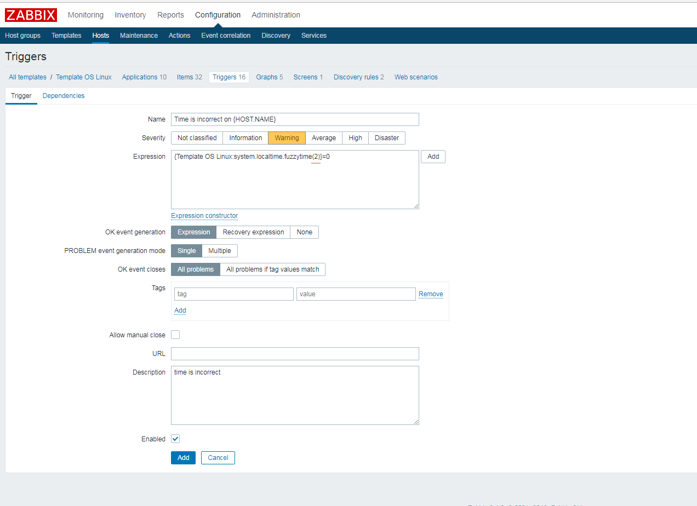

# 创建时间监控触发器
> Zabbix版本3.4.4

> **文档说明**: 

> zabbix的自带模板中已经存在关于服务器时间的Item(监控项)，我们只需要增加触发器即可实现监控效果；

> 由于zabbix server的web页面上无法创建一个全新的只包含localtime触发器的模板，所以才需要手动在zabbix的os模板中创建触发器。


   
#### 在Zabbix Server 的 Dashboard页面创建触发器
>    Configuration -> Templates -> Template OS Linux -> Triggers -> Create trigger

    

    
    
```
表达式：{Template OS Linux:system.localtime.fuzzytime(2)}=0

其中“2”为agent端时间与zabbix服务器时间的差值，单位是秒。 
````
